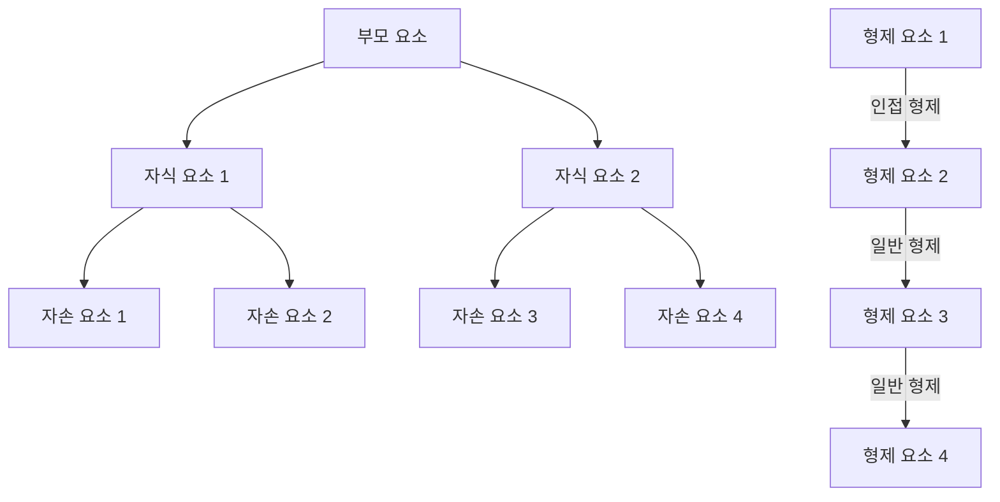
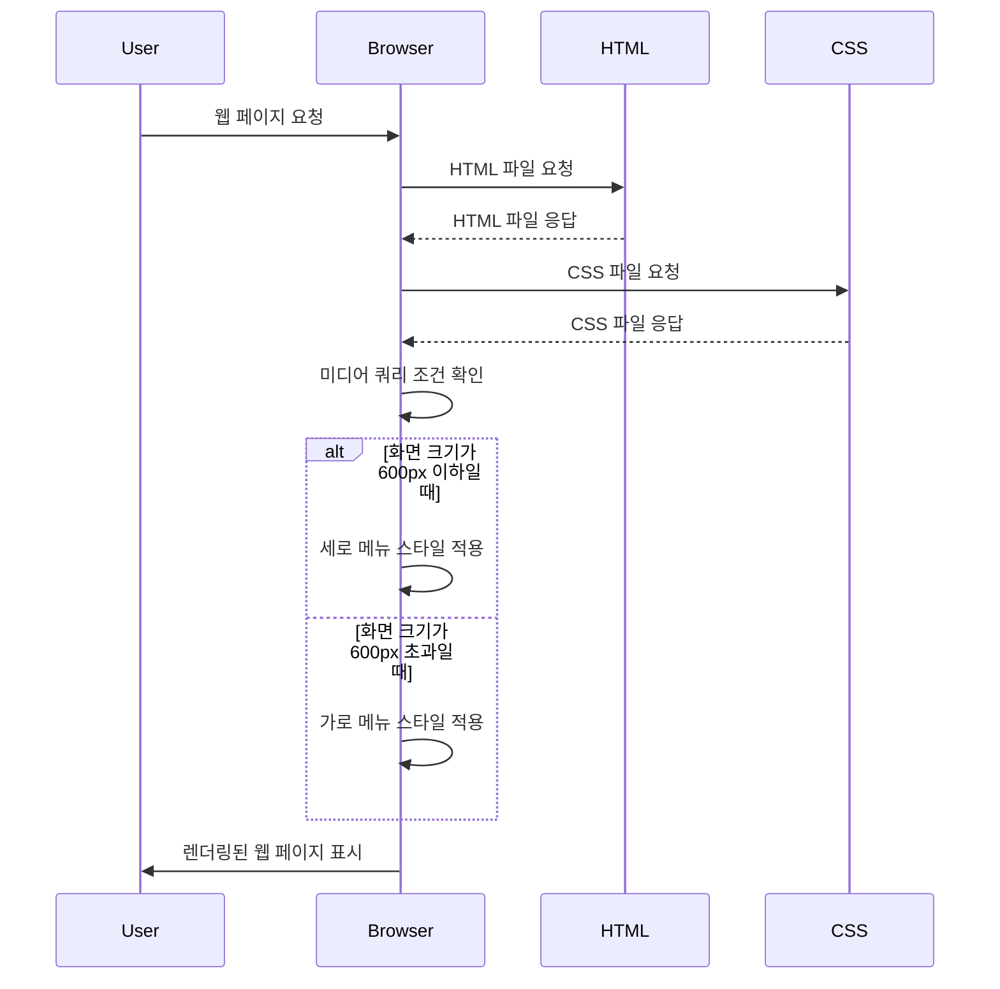
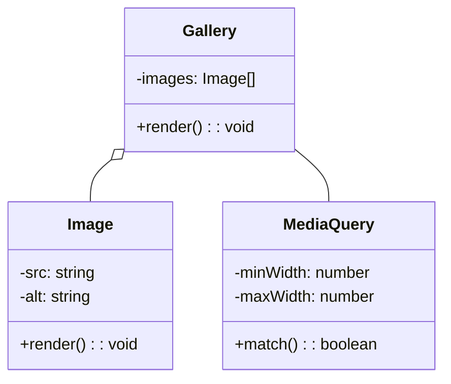
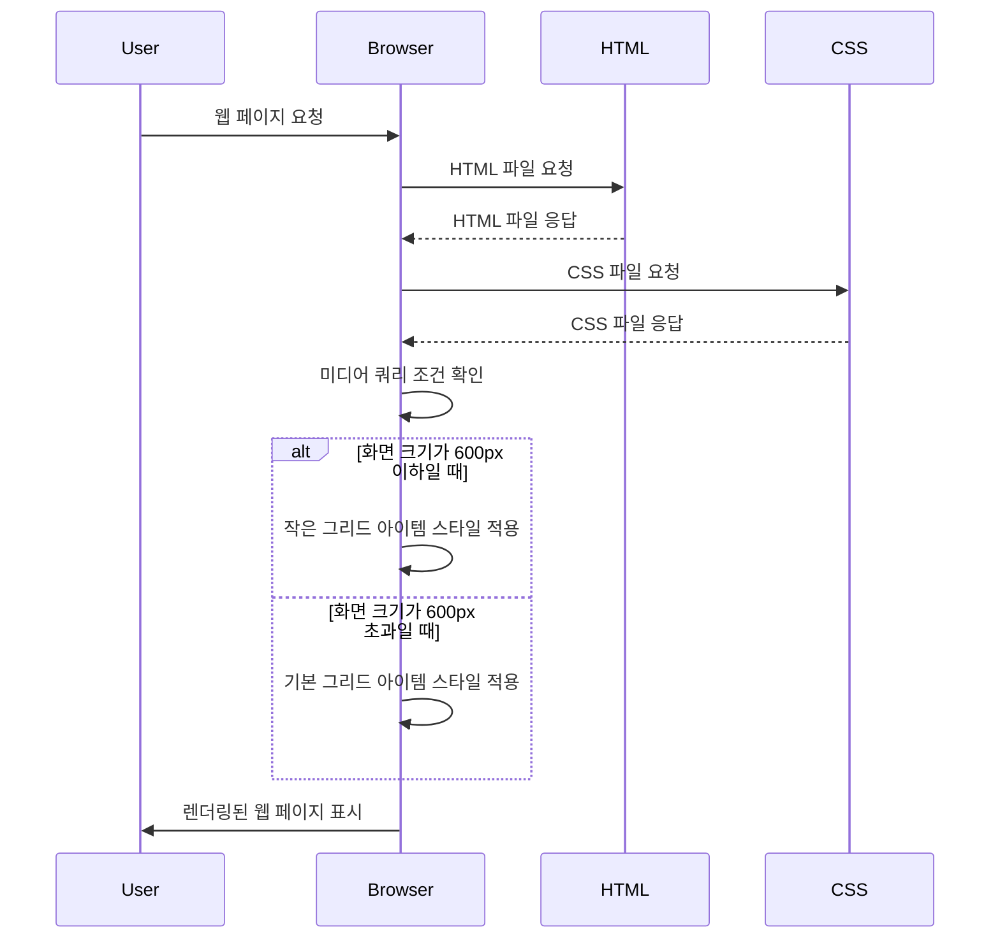

## 서문

안녕하세요, 여러분! 이번 가이드에서는 웹 개발의 핵심 기술 중 하나인 CSS(Cascading Style Sheets)에 대해 깊이 있게 알아보겠습니다. CSS는 HTML 문서의 스타일과 레이아웃을 정의하는 데 사용되며, 웹 페이지의 시각적인 표현을 제어합니다. 초보자부터 고급 개발자까지 CSS를 잘 이해하고 활용한다면 더욱 아름답고 사용자 친화적인 웹 페이지를 만들 수 있을 것입니다.

## 목차

1. CSS 소개
   - CSS란 무엇인가?
   - CSS의 역할과 중요성
   - CSS 문법 기초
2. CSS 선택자
   - 기본 선택자 (타입, 클래스, ID, 전체 선택자)
   - 결합자 (자손, 자식, 인접 형제, 일반 형제)
   - 속성 선택자
   - 가상 클래스와 가상 요소
3. CSS 속성 - 박스 모델
   - 박스 모델 이해하기
   - width, height, padding, border, margin
   - box-sizing 속성
4. CSS 속성 - typography
   - font-family, font-size, font-weight, font-style
   - color, text-align, text-decoration, line-height
   - 웹 폰트 사용하기
5. CSS 속성 - 배경과 색상
   - background-color, background-image, background-repeat, background-position
   - opacity, rgba, hsla
6. CSS 레이아웃
   - display 속성 (block, inline, inline-block)
   - float와 clear
   - position 속성 (static, relative, absolute, fixed)
   - Flexbox 기초
7. CSS 반응형 웹 디자인
   - 반응형 웹 디자인 소개
   - 미디어 쿼리 기초

## 1. CSS 소개

### 1.1 CSS란 무엇인가?

CSS(Cascading Style Sheets)는 웹 페이지의 스타일과 레이아웃을 정의하는 스타일시트 언어입니다. HTML이 웹 페이지의 구조와 콘텐츠를 담당한다면, CSS는 해당 콘텐츠를 시각적으로 어떻게 표현할지를 정의합니다. 즉, CSS를 사용하면 글꼴, 색상, 크기, 간격, 배치 등 웹 페이지의 다양한 스타일 속성을 제어할 수 있습니다.

CSS의 "Cascading"은 "계단식"이라는 뜻으로, 여러 개의 스타일시트를 조합하여 최종 스타일을 결정하는 방식을 의미합니다. 즉, 한 요소에 여러 스타일이 적용될 때, 어떤 순서와 우선순위로 적용될지를 결정하는 것이 바로 CSS의 핵심 개념 중 하나입니다.

### 1.2 CSS의 역할과 중요성

CSS는 웹 개발에서 매우 중요한 역할을 담당합니다. 과거에는 HTML 태그의 속성으로 스타일을 지정하거나, HTML 문서 내에 직접 스타일을 기술하는 방식이 사용되었습니다. 하지만 이러한 방식은 콘텐츠와 디자인이 혼재되어 유지보수가 어렵고, 코드의 가독성도 떨어지는 문제가 있었습니다.

CSS의 등장으로 콘텐츠(HTML)와 디자인(CSS)을 분리할 수 있게 되었고, 이는 웹 개발의 패러다임을 크게 바꾸어 놓았습니다. CSS를 활용하면 한 번의 스타일 정의로 다수의 웹 페이지에 일관된 디자인을 적용할 수 있어 효율성이 크게 향상됩니다. 또한, 스타일과 관련된 코드를 별도의 CSS 파일로 분리할 수 있어 코드의 가독성과 유지보수성도 크게 개선됩니다.

이러한 이유로 현대 웹 개발에서 CSS는 필수불가결한 기술로 자리 잡았으며, 숙련된 웹 개발자라면 반드시 CSS에 대한 깊이 있는 이해와 활용 능력을 갖추어야 합니다.

### 1.3 CSS 문법 기초

CSS의 기본 문법은 선택자(Selector)와 선언부(Declaration Block)로 구성됩니다.

- 선택자(Selector): 스타일을 적용할 HTML 요소를 지정합니다.
- 선언부(Declaration Block): 적용할 스타일을 정의하는 영역으로, `{ }` 중괄호로 묶입니다.
- 속성(Property)과 값(Value): 선언부 내에서 속성과 값을 콜론(`:`)으로 연결하여 스타일을 정의합니다.
- 각 선언은 세미콜론(`;`)으로 구분합니다.

```css
선택자 {
  속성: 값;
  속성: 값;
}
```

예를 들어, 모든 `<p>` 태그의 글자 색상을 파란색으로 변경하고 싶다면 다음과 같이 CSS 코드를 작성할 수 있습니다.

```css
p {
  color: blue;
}
```

위 코드에서 `p`는 선택자, `{ }`는 선언부, `color`는 속성, `blue`는 값입니다.

이처럼 CSS 문법은 비교적 간단하지만, 선택자와 속성의 종류가 다양하고 CSS의 상속과 우선순위 등의 개념이 존재하므로 체계적인 학습이 필요합니다. 이후 섹션에서는 CSS의 다양한 선택자와 속성, 레이아웃 기술 등에 대해 더욱 자세히 알아보겠습니다.

## 2. CSS 선택자

CSS 선택자(Selector)는 스타일을 적용할 HTML 요소를 지정하는 방법입니다. 선택자를 활용하면 특정 요소나 요소 그룹에 선택적으로 스타일을 적용할 수 있어 효율적인 스타일링이 가능합니다. 이 섹션에서는 다양한 종류의 CSS 선택자에 대해 알아보겠습니다.

### 2.1 기본 선택자

- 타입 선택자(Type Selector): HTML 태그 이름을 사용하여 요소를 선택합니다.
  ```css
  p {
    color: black;
  }
  ```
- 클래스 선택자(Class Selector): HTML 요소의 `class` 속성 값을 사용하여 요소를 선택합니다. 클래스 이름 앞에 점(`.`)을 붙입니다.
  ```css
  .highlight {
    background-color: yellow;
  }
  ```
- ID 선택자(ID Selector): HTML 요소의 `id` 속성 값을 사용하여 요소를 선택합니다. ID 이름 앞에 샵(`#`)을 붙입니다.
  ```css
  #logo {
    width: 200px;
  }
  ```
- 전체 선택자(Universal Selector): 별표(`*`)를 사용하여 모든 요소를 선택합니다.
  ```css
  * {
    margin: 0;
    padding: 0;
  }
  ```

### 2.2 결합자

- 자손 결합자(Descendant Combinator): 두 선택자 사이에 공백을 사용하여 첫 번째 선택자의 자손 요소 중 두 번째 선택자와 일치하는 모든 요소를 선택합니다.
  ```css
  div p {
    font-size: 16px;
  }
  ```
- 자식 결합자(Child Combinator): 두 선택자 사이에 `>`를 사용하여 첫 번째 선택자의 직계 자식 요소 중 두 번째 선택자와 일치하는 모든 요소를 선택합니다.
  ```css
  ul > li {
    list-style: none;
  }
  ```
- 인접 형제 결합자(Adjacent Sibling Combinator): 두 선택자 사이에 `+`를 사용하여 첫 번째 선택자의 바로 다음 형제 요소 중 두 번째 선택자와 일치하는 요소를 선택합니다.
  ```css
  h1 + p {
    margin-top: 20px;
  }
  ```
- 일반 형제 결합자(General Sibling Combinator): 두 선택자 사이에 `~`를 사용하여 첫 번째 선택자의 다음 형제 요소 중 두 번째 선택자와 일치하는 모든 요소를 선택합니다.
  ```css
  h1 ~ p {
    font-style: italic;
  }
  ```

---

### 자손 자식?

- 자손 결합자(Descendant Combinator):
  - 자손 결합자는 두 선택자 사이에 공백을 사용하여 표시합니다.
  - 첫 번째 선택자의 모든 자손 요소 중에서 두 번째 선택자와 일치하는 요소를 선택합니다.
  - 자손은 직계 자식뿐만 아니라 그 아래의 모든 하위 요소를 포함합니다.
  - 예를 들어, `div p`는 `<div>` 요소 내부의 모든 `<p>` 요소를 선택합니다. 이때 `<p>` 요소는 `<div>`의 직계 자식일 수도 있고, 더 깊은 레벨의 자손일 수도 있습니다.
- 자식 결합자(Child Combinator):
  - 자식 결합자는 두 선택자 사이에 `>`를 사용하여 표시합니다.
  - 첫 번째 선택자의 직계 자식 요소 중에서 두 번째 선택자와 일치하는 요소를 선택합니다.
  - 자식은 오직 첫 번째 선택자의 바로 아래 레벨에 있는 요소만을 의미합니다.
  - 예를 들어, `ul > li`는 `<ul>` 요소의 직계 자식인 `<li>` 요소만을 선택합니다. 더 깊은 레벨의 `<li>` 요소는 선택되지 않습니다.
- 인접 형제 결합자(Adjacent Sibling Combinator):
  - 인접 형제 결합자는 두 선택자 사이에 `+`를 사용하여 표시합니다.
  - 첫 번째 선택자의 바로 다음 형제 요소 중에서 두 번째 선택자와 일치하는 요소를 선택합니다.
  - 형제 요소란 같은 부모 요소를 가지는 요소들을 의미합니다.
  - 예를 들어, `h1 + p`는 `<h1>` 요소의 바로 다음에 오는 `<p>` 요소를 선택합니다. 이때 `<p>` 요소는 `<h1>`의 바로 다음 형제 요소여야 합니다.
- 일반 형제 결합자(General Sibling Combinator):
  - 일반 형제 결합자는 두 선택자 사이에 `~`를 사용하여 표시합니다.
  - 첫 번째 선택자의 다음 형제 요소 중에서 두 번째 선택자와 일치하는 모든 요소를 선택합니다.
  - 인접 형제 결합자와 달리, 일반 형제 결합자는 바로 다음 형제뿐만 아니라 그 이후의 모든 형제 요소를 선택합니다.
  - 예를 들어, `h1 ~ p`는 `<h1>` 요소의 다음에 오는 모든 `<p>` 요소를 선택합니다. 이때 `<p>` 요소는 `<h1>`의 형제 요소이면 됩니다.



1. 자손 결합자(Descendant Combinator):

   - `A`는 `B`와 `C`의 부모 요소입니다.
   - `B`와 `C`는 `A`의 자식 요소이며, `D`, `E`, `F`, `G`는 `A`의 자손 요소입니다.
   - 자손 결합자를 사용하여 `A`의 모든 자손 요소(`B`, `C`, `D`, `E`, `F`, `G`)를 선택할 수 있습니다.

2. 자식 결합자(Child Combinator):

   - `A`는 `B`와 `C`의 직계 부모 요소입니다.
   - 자식 결합자를 사용하여 `A`의 직계 자식 요소인 `B`와 `C`만을 선택할 수 있습니다.

3. 인접 형제 결합자(Adjacent Sibling Combinator):

   - `H`와 `I`는 인접한 형제 요소입니다.
   - 인접 형제 결합자를 사용하여 `H` 바로 다음에 오는 `I`를 선택할 수 있습니다.

4. 일반 형제 결합자(General Sibling Combinator):
   - `H`, `I`, `J`, `K`는 모두 형제 요소입니다.
   - 일반 형제 결합자를 사용하여 `H` 다음에 오는 모든 형제 요소(`I`, `J`, `K`)를 선택할 수 있습니다.

---

### 2.3 속성 선택자

속성 선택자(Attribute Selector)는 HTML 요소의 속성과 속성값을 기반으로 요소를 선택합니다.

1. `[속성]`: 지정된 속성을 가진 모든 요소를 선택합니다.

   - 속성의 존재 여부만으로 요소를 선택할 수 있습니다.
   - 예제:
     ```html
     <a href="https://www.example.com">링크 1</a> <a>링크 2</a>
     ```
     ```css
     [href] {
       color: blue;
     }
     ```
     위의 예제에서 `href` 속성을 가진 `<a>` 요소의 글자 색상이 파란색으로 설정됩니다. 두 번째 `<a>` 요소는 `href` 속성이 없으므로 영향을 받지 않습니다.

2. `[속성="값"]`: 지정된 속성과 값을 가진 모든 요소를 선택합니다.

   - 속성의 값이 정확히 일치하는 요소를 선택합니다.
   - 예제:
     ```html
     <input type="text" placeholder="이름을 입력하세요" />
     <input type="email" placeholder="이메일을 입력하세요" />
     ```
     ```css
     [type="text"] {
       width: 200px;
     }
     ```
     위의 예제에서 `type` 속성의 값이 "text"인 `<input>` 요소의 너비가 200px로 설정됩니다. `type` 속성의 값이 "email"인 요소는 영향을 받지 않습니다.

3. `[속성~="값"]`: 지정된 속성 값을 공백으로 구분한 단어 목록 중 하나로 포함하는 요소를 선택합니다.

   - 속성 값이 공백으로 구분된 단어 중 하나와 일치하는 요소를 선택합니다.
   - 예제:
     ```html
     <button class="btn primary">버튼 1</button>
     <button class="btn secondary">버튼 2</button>
     ```
     ```css
     [class~="primary"] {
       background-color: blue;
     }
     ```
     위의 예제에서 `class` 속성 값에 "primary"라는 단어가 포함된 `<button>` 요소의 배경색이 파란색으로 설정됩니다. 두 번째 `<button>` 요소는 "primary"라는 단어가 없으므로 영향을 받지 않습니다.

4. `[속성|="값"]`: 지정된 속성 값을 하이픈(`-`)으로 구분한 값 목록 중 첫 번째 값으로 시작하는 요소를 선택합니다.

   - 속성 값이 지정된 값으로 시작하거나, 지정된 값 다음에 하이픈(`-`)이 오는 요소를 선택합니다.
   - 예제:
     ```html
     <p lang="en">영어 단락</p>
     <p lang="en-US">미국 영어 단락</p>
     <p lang="fr">프랑스어 단락</p>
     ```
     ```css
     [lang|="en"] {
       font-style: italic;
     }
     ```
     위의 예제에서 `lang` 속성 값이 "en"으로 시작하는 `<p>` 요소의 글자 스타일이 이탤릭체로 설정됩니다. 첫 번째와 두 번째 `<p>` 요소가 선택되고, 세 번째 `<p>` 요소는 영향을 받지 않습니다.

5. `[속성^="값"]`: 지정된 속성 값으로 시작하는 요소를 선택합니다.

   - 속성 값이 지정된 값으로 시작하는 요소를 선택합니다.
   - 예제:
     ```html
     <a href="https://www.example.com">링크 1</a>
     <a href="http://www.example.com">링크 2</a>
     ```
     ```css
     [href^="https"] {
       color: green;
     }
     ```
     위의 예제에서 `href` 속성 값이 "https"로 시작하는 `<a>` 요소의 글자 색상이 녹색으로 설정됩니다. 첫 번째 `<a>` 요소만 선택되고, 두 번째 `<a>` 요소는 영향을 받지 않습니다.

6. `[속성$="값"]`: 지정된 속성 값으로 끝나는 요소를 선택합니다.

   - 속성 값이 지정된 값으로 끝나는 요소를 선택합니다.
   - 예제:
     ```html
     
     
     ```
     ```css
     [src$=".jpg"] {
       border: 1px solid black;
     }
     ```
     위의 예제에서 `src` 속성 값이 ".jpg"로 끝나는 `` 요소에 1px 두께의 검은색 테두리가 설정됩니다. 첫 번째 `` 요소만 선택되고, 두 번째 `` 요소는 영향을 받지 않습니다.

7. `[속성*="값"]`: 지정된 속성 값을 포함하는 요소를 선택합니다.
   - 속성 값에 지정된 값이 포함되어 있는 요소를 선택합니다.
   - 예제:
     ```html
     <div title="example">예제 1</div>
     <div title="sample">예제 2</div>
     ```
     ```css
     [title*="example"] {
       background-color: yellow;
     }
     ```
     위의 예제에서 `title` 속성 값에 "example"이 포함된 `<div>` 요소의 배경색이 노란색으로 설정됩니다. 첫 번째 `<div>` 요소만 선택되고, 두 번째 `<div>` 요소는 영향을 받지 않습니다.

이처럼 속성 선택자를 사용하면 HTML 요소의 속성과 속성값을 기반으로 요소를 선택하고 스타일을 적용할 수 있습니다. 다양한 속성 선택자를 조합하여 사용하면 더 세밀한 요소 선택이 가능합니다.

### 2.4 가상 클래스와 가상 요소

- 가상 클래스(Pseudo-class): 선택자에 추가하는 키워드로, 요소의 특정 상태를 정의합니다.

### 2.4.1 가상 클래스(Pseudo-class)

가상 클래스는 선택자에 추가하는 키워드로, 요소의 특정 상태를 정의합니다. 가상 클래스를 사용하면 요소의 상태에 따라 다른 스타일을 적용할 수 있습니다.

1. `:hover`: 마우스 포인터가 요소 위에 있을 때 적용되는 스타일을 정의합니다.

   - 예제:
     ```html
     <a href="https://www.example.com">링크</a>
     ```
     ```css
     a {
       color: blue;
     }
     a:hover {
       color: red;
     }
     ```
     위의 예제에서 `<a>` 요소의 기본 글자 색상은 파란색이지만, 마우스 포인터가 링크 위에 있을 때는 글자 색상이 빨간색으로 변경됩니다.

2. `:focus`: 요소가 포커스된 상태일 때 적용되는 스타일을 정의합니다.

   - 예제:
     ```html
     <input type="text" placeholder="이름을 입력하세요" />
     ```
     ```css
     input:focus {
       border: 2px solid blue;
     }
     ```
     위의 예제에서 `<input>` 요소가 포커스된 상태일 때 2px 두께의 파란색 테두리가 적용됩니다.

3. `:first-child`, `:last-child`: 형제 요소 중 첫 번째 또는 마지막 요소를 선택합니다.

   - 예제:
     ```html
     <ul>
       <li>첫 번째 항목</li>
       <li>두 번째 항목</li>
       <li>세 번째 항목</li>
     </ul>
     ```
     ```css
     li:first-child {
       font-weight: bold;
     }
     li:last-child {
       color: red;
     }
     ```
     위의 예제에서 첫 번째 `<li>` 요소의 글자 두께가 굵게 설정되고, 마지막 `<li>` 요소의 글자 색상이 빨간색으로 설정됩니다.

4. `:nth-child(n)`: 형제 요소 중 n번째 요소를 선택합니다.
   - n에는 숫자, 키워드(`even`, `odd`) 또는 수식(`2n+1`)이 들어갈 수 있습니다.
   - 예제:
     ```html
     <ul>
       <li>첫 번째 항목</li>
       <li>두 번째 항목</li>
       <li>세 번째 항목</li>
       <li>네 번째 항목</li>
     </ul>
     ```
     ```css
     li:nth-child(2) {
       color: green;
     }
     li:nth-child(odd) {
       background-color: #f0f0f0;
     }
     ```
     위의 예제에서 두 번째 `<li>` 요소의 글자 색상이 녹색으로 설정되고, 홀수 번째 `<li>` 요소의 배경색이 연한 회색으로 설정됩니다.

### 2.4.2 가상 요소(Pseudo-element)

가상 요소는 선택자에 추가하는 키워드로, 요소의 특정 부분을 선택하고 스타일을 적용할 수 있습니다. 가상 요소를 사용하면 HTML 구조를 변경하지 않고도 요소의 특정 부분에 스타일을 적용할 수 있습니다.

1. `::before`, `::after`: 요소의 콘텐츠 앞이나 뒤에 생성된 콘텐츠를 선택합니다. 주로 `content` 속성과 함께 사용됩니다.

   - 예제:
     ```html
     <p>중요한 내용</p>
     ```
     ```css
     p::before {
       content: "※ ";
       color: red;
     }
     p::after {
       content: " ※";
       color: red;
     }
     ```
     위의 예제에서 `<p>` 요소의 콘텐츠 앞뒤에 "※" 기호가 빨간색으로 추가됩니다.

2. `::first-letter`, `::first-line`: 요소의 첫 번째 글자 또는 첫 번째 줄을 선택합니다.
   - 예제:
     ```html
     <p>
       Lorem ipsum dolor sit amet, consectetur adipiscing elit. Sed euismod,
       nulla sit amet aliquam lacinia, nisl nisl aliquam nisl, nec aliquam nisl
       nisl sit amet nisl.
     </p>
     ```
     ```css
     p::first-letter {
       font-size: 24px;
       font-weight: bold;
     }
     p::first-line {
       color: blue;
     }
     ```
     위의 예제에서 `<p>` 요소의 첫 번째 글자는 크기가 24px이고 굵은 글자로 설정되며, 첫 번째 줄의 글자 색상은 파란색으로 설정됩니다.

가상 클래스와 가상 요소를 적절히 활용하면 HTML 구조를 변경하지 않고도 다양한 스타일 효과를 적용할 수 있습니다. 이를 통해 웹 페이지의 디자인을 보다 세밀하게 제어할 수 있으며, 사용자 경험을 향상시킬 수 있습니다.

가상 클래스와 가상 요소는 CSS의 강력한 기능 중 하나이므로, 다양한 상황에서 활용할 수 있도록 연습하는 것이 좋습니다. 예제를 참고하여 직접 코드를 작성해보고, 실제 웹 페이지에 적용해보는 것을 추천합니다.

---

## 3. CSS 속성 - 박스 모델

CSS 박스 모델(Box Model)은 HTML 요소를 박스로 간주하고, 각 박스를 구성하는 영역을 정의합니다. 박스 모델을 이해하면 요소의 크기, 여백, 테두리 등을 효과적으로 제어할 수 있습니다.

### 3.1 박스 모델 이해하기

박스 모델은 다음과 같은 4가지 영역으로 구성됩니다:

- 콘텐츠 영역(Content Area): 요소의 실제 내용이 표시되는 영역입니다.
- 안쪽 여백(Padding): 콘텐츠 영역과 테두리 사이의 여백입니다.
- 테두리(Border): 요소의 경계선입니다.
- 바깥쪽 여백(Margin): 요소와 인접한 요소 사이의 여백입니다.

박스 모델의 구조를 ASCII Art로 나타내면 다음과 같습니다:

```
       +-----------------------+
       |         Margin        |
       |  +-----------------+  |
       |  |     Border     |  |
       |  |  +-----------+  |  |
       |  |  |  Padding  |  |  |
       |  |  |  +-------+  |  |  |
       |  |  |  |Content|  |  |  |
       |  |  |  +-------+  |  |  |
       |  |  +-----------+  |  |
       |  +-----------------+  |
       +-----------------------+
```

### 3.2 width, height, padding, border, margin

- `width`, `height`: 요소의 너비와 높이를 지정합니다. 기본값은 콘텐츠 영역의 크기입니다.
  ```css
  div {
    width: 200px;
    height: 100px;
  }
  ```
- `padding`: 요소의 안쪽 여백을 지정합니다. 상하좌우 개별 지정도 가능합니다.
  ```css
  p {
    padding: 10px;
    padding-top: 20px;
  }
  ```
- `border`: 요소의 테두리를 지정합니다. 두께, 스타일, 색상을 함께 지정할 수 있습니다.
  ```css
  div {
    border: 1px solid black;
    border-bottom: 2px dashed red;
  }
  ```
- `margin`: 요소의 바깥쪽 여백을 지정합니다. 상하좌우 개별 지정도 가능합니다.
  ```css
  h1 {
    margin: 20px;
    margin-left: 40px;
  }
  ```

### 3.3 box-sizing 속성

`box-sizing` 속성은 박스 모델의 크기 계산 방식을 변경합니다.

- `content-box` (기본값): `width`와 `height`가 콘텐츠 영역만을 포함합니다. 안쪽 여백과 테두리는 별도로 계산되어 요소의 전체 크기에 영향을 줍니다.
- `border-box`: `width`와 `height`가 안쪽 여백과 테두리를 포함한 값이 됩니다. 즉, 지정된 크기 내에 콘텐츠 영역, 안쪽 여백, 테두리가 모두 포함됩니다.

```css
div {
  box-sizing: border-box;
}
```

`box-sizing: border-box`를 사용하면 요소의 크기를 예측하기 쉽고, 레이아웃을 더욱 직관적으로 구성할 수 있습니다.

## 4. CSS 속성 - typography

Typography는 텍스트의 스타일과 관련된 속성들을 다룹니다. 글꼴, 크기, 색상, 정렬 등을 조절하여 가독성과 심미성을 향상시킬 수 있습니다.

### 4.1 font-family, font-size, font-weight, font-style

- `font-family`: 글꼴을 지정합니다. 여러 개의 글꼴을 쉼표로 구분하여 나열할 수 있으며, 브라우저는 순서대로 지원되는 글꼴을 선택합니다.
  ```css
  body {
    font-family: "Arial", sans-serif;
  }
  ```
- `font-size`: 글자 크기를 지정합니다. 절대 단위(`px`, `pt` 등)와 상대 단위(`em`, `rem`, `%` 등)를 사용할 수 있습니다.
  ```css
  p {
    font-size: 16px;
    font-size: 1.2em;
  }
  ```
- `font-weight`: 글자의 두께를 지정합니다. 키워드(`normal`, `bold` 등)나 숫자 값(`100`~`900`)을 사용할 수 있습니다.
  ```css
  h1 {
    font-weight: bold;
  }
  ```
- `font-style`: 글자의 스타일을 지정합니다. `normal`, `italic`, `oblique` 등의 값을 사용할 수 있습니다.
  ```css
  em {
    font-style: italic;
  }
  ```

### 4.2 color, text-align, text-decoration, line-height

- `color`: 글자 색상을 지정합니다. 색상 이름, HEX 코드, RGB 값 등을 사용할 수 있습니다.
  ```css
  p {
    color: blue;
    color: #0000ff;
    color: rgb(0, 0, 255);
  }
  ```
- `text-align`: 텍스트의 수평 정렬을 지정합니다. `left`, `center`, `right`, `justify` 등의 값을 사용할 수 있습니다.
  ```css
  h1 {
    text-align: center;
  }
  ```
- `text-decoration`: 텍스트에 장식 효과를 적용합니다. `none`, `underline`, `overline`, `line-through` 등의 값을 사용할 수 있습니다.
  ```css
  a {
    text-decoration: none;
  }
  ```
- `line-height`: 줄 간격을 지정합니다. 숫자 값이나 단위를 사용할 수 있습니다.
  ```css
  p {
    line-height: 1.5;
  }
  ```

### 4.3 웹 폰트 사용하기

웹 폰트를 사용하면 사용자의 컴퓨터에 설치되지 않은 글꼴도 웹 페이지에서 사용할 수 있습니다. `@font-face` 규칙을 사용하여 웹 폰트를 정의하고, `font-family` 속성으로 웹 폰트를 적용합니다.

```css
@font-face {
  font-family: "MyWebFont";
  src: url("webfont.woff2") format("woff2"), url("webfont.woff") format("woff");
}

body {
  font-family: "MyWebFont", sans-serif;
}
```

웹 폰트를 사용할 때는 로딩 속도와 브라우저 호환성을 고려해야 합니다. 다양한 포맷의 폰트 파일을 제공하고, 폴백(fallback) 글꼴을 지정하는 것이 좋습니다.

## 5. CSS 속성 - 배경과 색상

CSS를 사용하여 요소의 배경과 색상을 다양하게 지정할 수 있습니다. 이를 통해 웹 페이지의 시각적 효과를 높일 수 있습니다.

### 5.1 background-color, background-image, background-repeat, background-position

- `background-color`: 요소의 배경 색상을 지정합니다. 색상 이름, HEX 코드, RGB 값 등을 사용할 수 있습니다.
  ```css
  div {
    background-color: #f0f0f0;
  }
  ```
- `background-image`: 요소의 배경 이미지를 지정합니다. `url()` 함수를 사용하여 이미지 파일 경로를 지정합니다.
  ```css
  header {
    background-image: url("header-bg.jpg");
  }
  ```
- `background-repeat`: 배경 이미지의 반복 방식을 지정합니다. `repeat`, `repeat-x`, `repeat-y`, `no-repeat` 등의 값을 사용할 수 있습니다.
  ```css
  body {
    background-image: url("pattern.png");
    background-repeat: repeat-x;
  }
  ```
- `background-position`: 배경 이미지의 위치를 지정합니다. 키워드(`left`, `center`, `right`, `top`, `bottom`)나 백분율, 길이 값을 사용할 수 있습니다.
  ```css
  div {
    background-image: url("logo.png");
    background-repeat: no-repeat;
    background-position: right top;
  }
  ```

### 5.2 opacity, rgba, hsla

- `opacity`: 요소의 투명도를 지정합니다. 0부터 1 사이의 값을 사용하며, 0은 완전히 투명, 1은 완전히 불투명합니다.
  ```css
  img {
    opacity: 0.5;
  }
  ```
- `rgba`: RGB 색상에 투명도를 추가한 값입니다. 마지막 인자로 0부터 1 사이의 투명도 값을 받습니다.
  ```css
  div {
    background-color: rgba(255, 0, 0, 0.5);
  }
  ```
- `hsla`: HSL 색상에 투명도를 추가한 값입니다. 마지막 인자로 0부터 1 사이의 투명도 값을 받습니다.
  ```css
  p {
    color: hsla(120, 100%, 50%, 0.8);
  }
  ```

`rgba`와 `hsla`를 사용하면 요소에 반투명 효과를 적용할 수 있어 다양한 시각적 효과를 연출할 수 있습니다.

## 6. CSS 레이아웃

CSS를 사용하여 웹 페이지의 레이아웃을 구성할 수 있습니다. 요소의 배치, 정렬, 크기 조절 등을 통해 효과적인 레이아웃을 만들어 낼 수 있습니다.

### 6.1 display 속성 (block, inline, inline-block)

`display` 속성은 요소의 박스 타입을 지정합니다.

- `block`: 블록 레벨 요소로 지정합니다. 요소가 가로 영역을 모두 차지하고 줄 바꿈이 일어납니다.
  ```css
  div {
    display: block;
  }
  ```
- `inline`: 인라인 레벨 요소로 지정합니다. 요소가 콘텐츠의 크기만큼만 차지하고 줄 바꿈이 일어나지 않습니다.
  ```css
  span {
    display: inline;
  }
  ```
- `inline-block`: 인라인 레벨 요소처럼 한 줄에 배치되지만, 블록 레벨 요소처럼 크기를 지정할 수 있습니다.
  ```css
  img {
    display: inline-block;
    width: 200px;
    height: 150px;
  }
  ```

### 6.2 float와 clear

`float` 속성은 요소를 왼쪽이나 오른쪽으로 띄워 텍스트 및 인라인 요소가 그 주위를 감싸도록 합니다.

- `left`: 요소를 왼쪽으로 띄웁니다.
- `right`: 요소를 오른쪽으로 띄웁니다.
- `none`: 띄움 효과를 제거합니다.

```css
img {
  float: left;
  margin-right: 10px;
}
```

`clear` 속성은 `float` 속성이 적용된 요소의 주위로 컨텐츠가 흐르는 것을 방지합니다.

- `left`: 왼쪽 띄움을 취소합니다.
- `right`: 오른쪽 띄움을 취소합니다.
- `both`: 왼쪽과 오른쪽 띄움을 모두 취소합니다.

```css
.clearfix::after {
  content: "";
  display: block;
  clear: both;
}
```

위 예제의 `.clearfix` 클래스를 float 요소의 부모 요소에 적용하면, float 요소 다음에 오는 요소들이 float 요소 아래로 내려가는 것을 방지할 수 있습니다.

### 6.3 position 속성 (static, relative, absolute, fixed)

`position` 속성은 요소의 위치를 지정하는 방법을 설정합니다.

- `static`: 기본값으로, 요소를 문서의 일반적인 흐름에 따라 배치합니다.
- `relative`: 요소를 일반적인 위치에서 상대적으로 이동시킵니다. 다른 요소의 레이아웃에는 영향을 주지 않습니다.
- `absolute`: 요소를 문서의 일반적인 흐름에서 제거하고, 가장 가까운 위치 지정 조상 요소를 기준으로 배치합니다.
- `fixed`: 요소를 문서의 일반적인 흐름에서 제거하고, 뷰포트를 기준으로 배치합니다. 스크롤해도 항상 같은 위치에 있습니다.

```css
.relative {
  position: relative;
  top: 20px;
  left: 20px;
}

.absolute {
  position: absolute;
  bottom: 0;
  right: 0;
}

.fixed {
  position: fixed;
  top: 0;
  left: 0;
}
```

### 6.4 Flexbox 기초

Flexbox는 CSS3에서 introduced된 레이아웃 모델로, 요소의 정렬과 분배를 유연하게 할 수 있습니다.

- `display: flex;`를 컨테이너 요소에 적용하여 Flexbox를 활성화합니다.
- `flex-direction`으로 주축(main axis)의 방향을 설정합니다. (`row`, `row-reverse`, `column`, `column-reverse`)
- `justify-content`로 주축을 따라 요소를 정렬하고 분배합니다. (`flex-start`, `flex-end`, `center`, `space-between`, `space-around`)
- `align-items`로 교차축(cross axis)을 따라 요소를 정렬합니다. (`flex-start`, `flex-end`, `center`, `baseline`, `stretch`)

```css
.container {
  display: flex;
  flex-direction: row;
  justify-content: space-between;
  align-items: center;
}
```

위 예제는 컨테이너 요소 내부의 자식 요소들을 가로 방향으로 배치하고, 요소 사이의 공간을 균등하게 분배하며, 교차축 중앙에 정렬합니다.

Flexbox를 사용하면 복잡한 레이아웃도 쉽게 구현할 수 있어 반응형 웹 디자인에 매우 유용합니다.

## 7. CSS 반응형 웹 디자인

### 7.1 반응형 웹 디자인 소개

반응형 웹 디자인(Responsive Web Design)은 다양한 기기와 화면 크기에 맞게 웹 페이지의 레이아웃과 스타일을 자동으로 조정하는 디자인 접근 방식입니다. 반응형 웹 디자인을 통해 하나의 웹 페이지로 데스크톱, 태블릿, 스마트폰 등 다양한 기기에 최적화된 사용자 경험을 제공할 수 있습니다.

반응형 웹 디자인의 핵심 개념은 다음과 같습니다:

- 유연한 그리드 레이아웃: 픽셀 대신 퍼센트 기반의 유연한 크기를 사용하여 레이아웃을 구성합니다.
- 유연한 이미지와 미디어: 이미지와 비디오 등의 미디어 요소도 유연하게 크기를 조절할 수 있도록 합니다.
- 미디어 쿼리: 화면 크기나 기기 특성에 따라 스타일을 적용할 수 있는 기능입니다.

### 7.2 미디어 쿼리 기초

미디어 쿼리(Media Query)는 화면 크기, 해상도, 기기 방향 등의 조건에 따라 서로 다른 스타일을 적용할 수 있게 해주는 CSS3의 기능입니다. 미디어 쿼리를 사용하면 반응형 웹 디자인을 효과적으로 구현할 수 있습니다.

미디어 쿼리의 기본 구문은 다음과 같습니다:

```css
@media (미디어 특성) {
  /* 조건에 맞는 경우 적용할 CSS 스타일 */
}
```

미디어 특성에는 다양한 조건을 사용할 수 있습니다. 몇 가지 예를 살펴보겠습니다:

- `min-width`, `max-width`: 화면의 가로 크기에 따라 스타일을 적용합니다.
  ```css
  @media (max-width: 600px) {
    /* 가로 크기가 600px 이하일 때 적용할 스타일 */
  }
  ```
- `min-height`, `max-height`: 화면의 세로 크기에 따라 스타일을 적용합니다.
  ```css
  @media (min-height: 400px) {
    /* 세로 크기가 400px 이상일 때 적용할 스타일 */
  }
  ```
- `orientation`: 기기의 방향(가로 또는 세로)에 따라 스타일을 적용합니다.
  ```css
  @media (orientation: landscape) {
    /* 가로 방향일 때 적용할 스타일 */
  }
  ```

미디어 쿼리를 사용하여 반응형 레이아웃을 구현하는 예제를 살펴보겠습니다:

```css
/* 기본 스타일 */
.container {
  display: flex;
  flex-wrap: wrap;
}

.item {
  flex: 1 1 300px;
  margin: 10px;
}

/* 가로 크기가 768px 이하일 때 적용할 스타일 */
@media (max-width: 768px) {
  .item {
    flex: 1 1 50%;
  }
}

/* 가로 크기가 480px 이하일 때 적용할 스타일 */
@media (max-width: 480px) {
  .item {
    flex: 1 1 100%;
  }
}
```

위 예제에서는 Flexbox를 사용하여 기본적으로 `.item` 요소를 가로로 나열하고, 화면 크기에 따라 한 줄에 표시되는 `.item`의 개수를 조절합니다. 가로 크기가 768px 이하일 때는 한 줄에 2개의 `.item`이, 480px 이하일 때는 한 줄에 1개의 `.item`이 표시되도록 스타일을 적용했습니다.

이처럼 미디어 쿼리를 활용하면 화면 크기에 따라 유연하게 레이아웃을 변경할 수 있어 다양한 기기에 최적화된 사용자 경험을 제공할 수 있습니다.

## 실전 예제

### 예제 1: 반응형 네비게이션 바

```html
<!DOCTYPE html>
<html>
  <head>
    <title>반응형 네비게이션 바</title>
    <style>
      /* 기본 스타일 */
      nav {
        background-color: #333;
      }

      nav ul {
        list-style-type: none;
        margin: 0;
        padding: 0;
      }

      nav ul li {
        display: inline-block;
      }

      nav ul li a {
        display: block;
        color: white;
        text-align: center;
        padding: 14px 16px;
        text-decoration: none;
      }

      /* 반응형 스타일 */
      @media screen and (max-width: 600px) {
        nav ul li {
          display: block;
        }
      }
    </style>
  </head>
  <body>
    <nav>
      <ul>
        <li><a href="#">Home</a></li>
        <li><a href="#">About</a></li>
        <li><a href="#">Services</a></li>
        <li><a href="#">Contact</a></li>
      </ul>
    </nav>
  </body>
</html>
```

이 예제는 반응형 네비게이션 바를 구현한 것입니다. 기본적으로는 가로로 메뉴 항목을 나열하지만, 화면 크기가 600px 이하일 때는 세로로 메뉴 항목을 나열하도록 스타일을 변경합니다.

코드 작동 원리를 시퀀스 다이어그램으로 나타내면 다음과 같습니다:



사용자가 웹 페이지를 요청하면, 브라우저는 HTML과 CSS 파일을 받아옵니다. 그리고 브라우저는 미디어 쿼리 조건을 확인하여 화면 크기에 따라 적절한 스타일을 적용합니다. 최종적으로 렌더링된 웹 페이지가 사용자에게 표시됩니다.

### 예제 2: 반응형 이미지 갤러리

```html
<!DOCTYPE html>
<html>
  <head>
    <title>반응형 이미지 갤러리</title>
    <style>
      .gallery {
        display: flex;
        flex-wrap: wrap;
        justify-content: center;
      }

      .gallery img {
        width: 100%;
        height: auto;
        margin: 5px;
      }

      @media screen and (min-width: 600px) {
        .gallery img {
          width: calc(50% - 10px);
        }
      }

      @media screen and (min-width: 1200px) {
        .gallery img {
          width: calc(25% - 10px);
        }
      }
    </style>
  </head>
  <body>
    <div class="gallery">
      
      
      
      
      
      
    </div>
  </body>
</html>
```

이 예제는 반응형 이미지 갤러리를 구현한 것입니다. Flexbox를 사용하여 이미지를 가로로 나열하고, 화면 크기에 따라 이미지의 크기와 한 줄에 표시되는 이미지의 개수를 조절합니다.

코드 작동 원리를 클래스 다이어그램으로 나타내면 다음과 같습니다:



`Gallery` 클래스는 여러 개의 `Image` 객체를 포함하고 있으며, `render()` 메서드를 통해 이미지를 렌더링합니다. `Image` 클래스는 이미지의 소스(`src`)와 대체 텍스트(`alt`)를 가지고 있습니다.

`MediaQuery` 클래스는 미디어 쿼리 조건을 나타내며, `match()` 메서드를 통해 현재 화면 크기가 조건에 부합하는지 확인합니다. `Gallery` 클래스는 `MediaQuery` 객체를 사용하여 화면 크기에 따라 적절한 스타일을 적용합니다.

### 예제 3: 반응형 그리드

```html
<!DOCTYPE html>
<html>
  <head>
    <title>반응형 그리드</title>
    <style>
      .grid {
        display: grid;
        grid-template-columns: repeat(auto-fit, minmax(200px, 1fr));
        grid-gap: 20px;
      }

      .grid-item {
        background-color: #f1f1f1;
        padding: 20px;
        text-align: center;
        font-size: 24px;
      }

      @media screen and (max-width: 600px) {
        .grid {
          grid-template-columns: repeat(auto-fit, minmax(150px, 1fr));
          grid-gap: 10px;
        }

        .grid-item {
          font-size: 18px;
        }
      }
    </style>
  </head>
  <body>
    <div class="grid">
      <div class="grid-item">Item 1</div>
      <div class="grid-item">Item 2</div>
      <div class="grid-item">Item 3</div>
      <div class="grid-item">Item 4</div>
      <div class="grid-item">Item 5</div>
      <div class="grid-item">Item 6</div>
    </div>
  </body>
</html>
```

이 예제는 반응형 그리드를 구현한 것입니다. CSS Grid를 사용하여 아이템을 그리드 형태로 배치하고, `repeat()`와 `minmax()` 함수를 활용하여 반응형 그리드를 만들었습니다. 화면 크기에 따라 그리드 아이템의 크기와 간격이 조절됩니다.

코드 작동 원리를 시퀀스 다이어그램으로 나타내면 다음과 같습니다:



사용자가 웹 페이지를 요청하면, 브라우저는 HTML과 CSS 파일을 받아옵니다. 그리고 브라우저는 미디어 쿼리 조건을 확인하여 화면 크기에 따라 적절한 그리드 스타일을 적용합니다. 최종적으로 렌더링된 웹 페이지가 사용자에게 표시됩니다.

이상으로 CSS에 대한 가이드를 마무리하겠습니다. 이 가이드에서는 CSS의 기본 개념부터 선택자, 속성, 레이아웃, 반응형 웹 디자인까지 폭넓게 다루었습니다. 또한, 실전 예제를 통해 배운 내용을 실제로 어떻게 활용할 수 있는지 살펴보았습니다.

CSS는 웹 개발에서 매우 중요한 역할을 담당하며, 숙련된 웹 개발자라면 반드시 깊이 있게 이해하고 활용할 수 있어야 합니다. 이 가이드를 통해 CSS에 대한 이해도를 높이고, 더 나아가 창의적이고 아름다운 웹 페이지를 만들 수 있는 기반을 다졌기를 바랍니다.

앞으로도 꾸준히 공부하고 실습하면서 CSS 실력을 키워나가시길 응원하겠습니다. 감사합니다!
